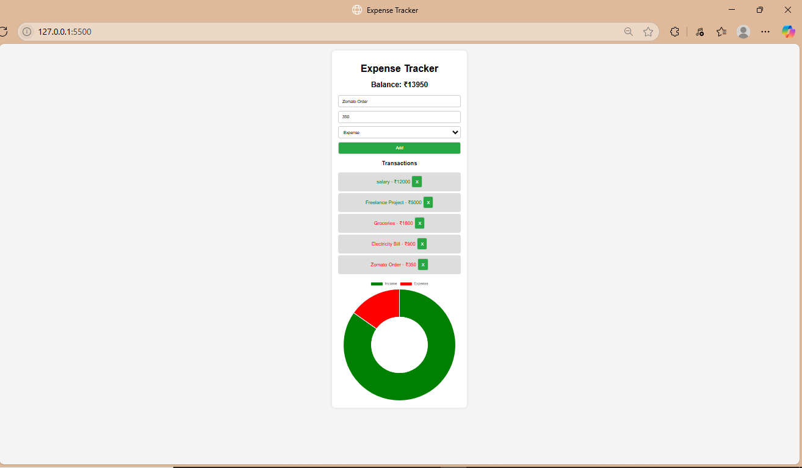

# 💸 Expense Tracker (₹ Rupees Version)

This is a simple Expense Tracker web app built using **HTML, CSS, and JavaScript**.
It helps you track your income and expenses and visualize them using a **doughnut chart (Chart.js)**.

---

## 🔧 Features

* Add income and expense transactions.
* Automatic calculation of **total balance**.
* Color-coded transaction list (green = income, red = expense).
* **Live doughnut chart** to visualize Income vs Expense.
* Fully responsive and clean UI.
* Supports **Indian Rupees (₹)** instead of dollars.

---

## 📸 Screenshot



---

## 🚀 Demo Entries (You Can Try)

| Description       | Amount (₹) | Type    |
| ----------------- | ---------- | ------- |
| Salary            | 12000      | Income  |
| Freelance Project | 5000       | Income  |
| Groceries         | 1800       | Expense |
| Electricity Bill  | 900        | Expense |
| Zomato Order      | 350        | Expense |

---

## 📂 Project Structure

```
📁 expense-tracker/
🔗 index.html
🔗 style.css
🔗 script.js
🔗 screenshot.png
```

---

## 📆 How to Use

1. Clone the repository:

```bash
git clone https://github.com/Krishna-Gupta989/expense-tracker.git
```

2. Open the folder:

```bash
cd expense-tracker
```

3. Run it:

* Just open `index.html` in your browser.

---

## 📚 Tech Stack

* HTML
* CSS
* JavaScript
* Chart.js (CDN)

---

## 🤝 Contributing

Feel free to fork the repo and raise a pull request if you want to improve this app.

---

## 🧑‍💻 Author

Made with ❤️ by \[Your Name]
